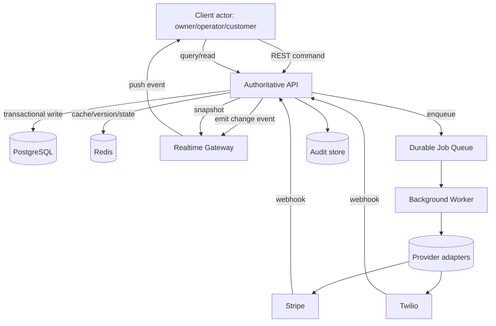

# Event and Data Flow

## High-level API + event flow

## Authority and state flow

- Durable writes: API + DB transaction.
- Outbox events: DB transaction emits event envelope for asynchronous consumers.
- Realtime channel: replayable event stream with revision-based deltas and snapshot fallback.
- Jobs: side-effect operations are owned by worker and observed by API state transitions.

## API contract split

- REST/HTTP:
  - command submission
  - snapshots
  - explicit resync endpoints
  - entitlement and lifecycle checkpoints
- WebSocket:
  - near-real-time update propagation
  - incremental patch delivery with revision
  - optional full-state re-sync
- Idempotent semantics:
  - safe replay for mutable commands
  - stable error codes for conflict and stale-revision states

## Snapshot and resync strategy

1. Client sends last seen revision and location scope on connect.
2. Server sends delta stream from that revision when possible.
3. If history is unavailable, server sends signed full snapshot.
4. Client reconciles snapshot and requests missing deltas by revision.

## Event contracts

- `queue.updated` includes queue/entry revision, actor ID, and location scope.
- `location.entitlement.updated` includes `entitlement_version`, `subscription_state`, `trial_state`.
- `billing.ledger.updated` includes usage counters and idempotency references.
- `auth.session.revoked` includes token version and invalidation reason.
