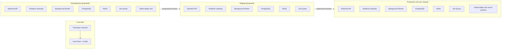

# Deployment Model

## Summary

Release 1 architecture assumes a **proposed deployment topology** only. No environments are provisioned in this repository yet.

## Environment definitions

### Local development

- Purpose: developer documentation, command validation, and architecture proofing.
- Compute: local machine only.
- Services: PostgreSQL/Redis via local containers when required by later milestones (not initialized in this milestone).
- Network: internet only for documentation tooling.
- Logging/metrics: none (local stdout/stderr only for now).
- Backups: none.

### Development environment

- Purpose: integration and feature-level verification.
- Public entry points: API HTTPS, websocket endpoint, web endpoints, webhooks.
- Private entry points: worker ingress, observability collectors, DB admin network restrictions.
- Data plane: PostgreSQL, Redis, durable job queue, provider sandbox webhooks.
- Security: secret store for environment-specific credentials (non-production only).
- Backups: encrypted snapshots (no automated restore cadence yet).
- Logging: request and job logs at INFO/WARN.
- Alerts: webhook failure spikes, auth failures, tenant isolation denials.
- Deployment: continuous deployment path from feature branches or milestone tags (proposed, no pipeline yet).
- Mobile/web compatibility: web APIs remain backward compatible within one major version across rollout.

### Staging environment

- Purpose: acceptance against milestone gates before production rollout.
- Public/private boundaries mirror production with synthetic tenant data.
- Secrets: managed identity-based injection; no production credentials.
- Backups: nightly logical snapshot plus periodic restoration drill evidence.
- Observability: full metric coverage and structured logs.
- Rollback: image/database rollback with queue freeze window for active jobs.
- Deployment: staged promotion from development with migration and compatibility checks.

### Production environment

- Purpose: customer-facing availability.
- Not yet created. The milestone only defines the architecture.
- Assumptions: multi-availability-zone deployment for API and websocket gateways, managed PostgreSQL/Redis with failover.

## Topology and components

| Component | Public entry point | Private entry point | Required for Release 1? | Deployment unit |
| --- | --- | --- | --- | --- |
| Auth/API | HTTPS | Internal admin control plane | Yes | `api` service |
| Realtime gateway | WebSocket | Internal metrics/admin | Yes | `realtime` process |
| Background worker | none | queue/job runner ingress | Yes | `worker` process |
| PostgreSQL | none | db admin subnet | Yes | managed database |
| Redis | none | internal subnet | Yes (selected) | managed cache/lock store |
| Durable job queue | none | scheduler/internals | Yes | queue subsystem |
| Contracts package | no runtime | no runtime | Yes | source artifact |
| Observability sink | metrics exporters | dashboards/alerts | Yes | third-party or in-house |
| Object storage | signed upload/download | admin ingestion | Planned | storage bucket |
| Storage for audit artifacts | none | job/admin tools | Planned | append storage |

## Disaster assumptions

- **Database recovery**: point-in-time recovery and full restore with retention windows.
- **Redis recovery**: rebuild from DB and queue state; replay windows acceptable for near-real-time.
- **Queue recovery**: at-least-once jobs with deduplication and idempotency.
- **Network recovery**: websocket reconnection with full snapshot fallback.

## Deployment path (proposed)

1. API + Websocket release with backward-compatible API contracts.
2. Contract publish to `packages/contracts`.
3. Background workers and job queue canary.
4. Provider webhooks staging before production cutover.
5. Controlled rollout by location cohort.
6. Operations readiness sign-off (alerts + rollback test + restore evidence).
